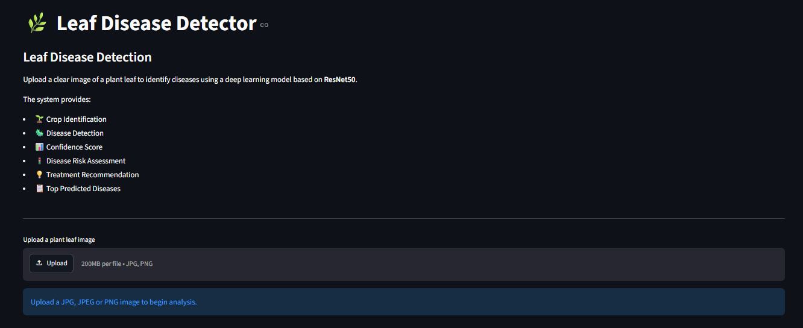
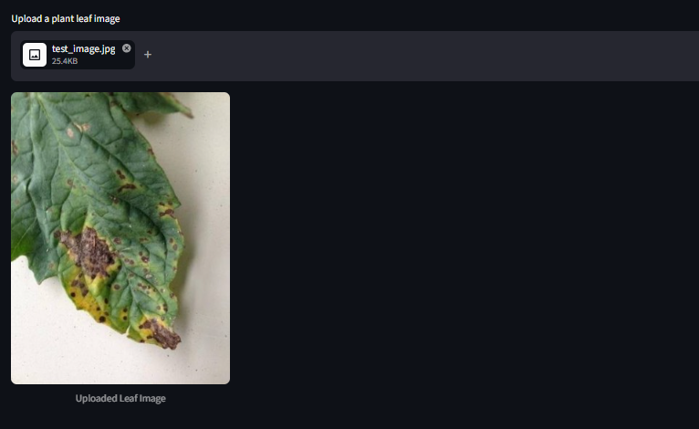
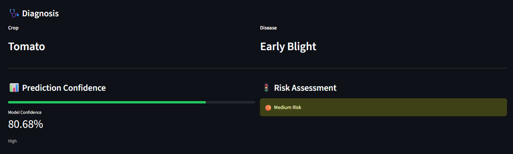
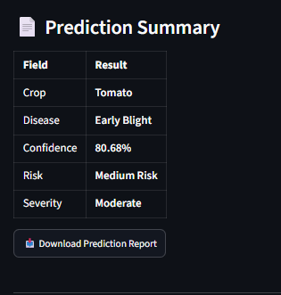
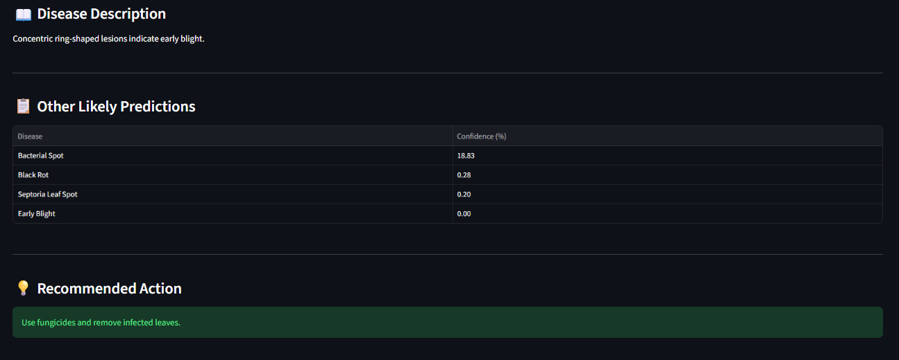

# 🌿 Leaf Disease Detection with Multi-Risk Assessment

<p align="center">
  
</p>

<p align="center">

<a href="https://leaf-disease-detection-multi-risk.streamlit.app/">

</a>

<a href="https://github.com/Renuka1510/Leaf-Disease-Detection">

</a>


</p>

---

## 🚀 Live Demo

### 👉 **Try the application here**

### **https://leaf-disease-detection-multi-risk.streamlit.app/**

No installation required. Simply upload a plant leaf image and receive an instant disease prediction along with confidence scores, multi-risk assessment, and treatment recommendations.

---

# 📖 Overview

Leaf Disease Detection with Multi-Risk Assessment is a deep learning-powered web application that detects plant leaf diseases using **ResNet50 Transfer Learning** trained on the **PlantVillage Dataset**.

The application enables users to upload a leaf image and instantly obtain:

- 🌱 Crop Identification
- 🦠 Disease Classification
- 📊 Prediction Confidence
- ⚠️ Multi-Risk Assessment
- 📖 Disease Description
- 💊 Treatment Recommendations
- 📋 Top Alternative Predictions

---

# ✨ Features

- 🌿 Deep Learning-based Disease Detection
- 🧠 ResNet50 Transfer Learning
- 📊 Confidence Analysis
- ⚠️ Multi-Risk Assessment
- 📚 Disease Information Database
- 💡 Treatment Recommendations
- 📄 Downloadable Prediction Report
- 🌐 Interactive Streamlit Web Application
- ☁️ Hugging Face Model Hosting

---

# 📸 Application Preview

| Home Page | Upload Image |
|------------|--------------|
|  |  |

| Disease Prediction | Prediction Summary |
|--------------------|--------------------|
|  |  |

| Multi-Risk Assessment |
|-----------------------|
|  |

---

# 🛠️ Tech Stack

| Category | Technology |
|----------|------------|
| Language | Python |
| Deep Learning | TensorFlow / Keras |
| Model | ResNet50 (Transfer Learning) |
| Web Framework | Streamlit |
| Dataset | PlantVillage |
| Model Hosting | Hugging Face |

---

# 📂 Project Structure

```text
Leaf-Disease-Detection/
│
├── Assets/
│   ├── logo.png
│   └── style.css
│
├── Models/
│   └── class_names.json
│
├── Screenshots/
│
├── app.py
├── predictor.py
├── multirisk.py
├── disease_info.py
├── ui.py
├── utils.py
├── config.py
├── requirements.txt
└── README.md
```

---

# ⚙️ Installation

### Clone the repository

```bash
git clone https://github.com/Renuka1510/Leaf-Disease-Detection.git
```

### Navigate to the project directory

```bash
cd Leaf-Disease-Detection
```

### Install dependencies

```bash
pip install -r requirements.txt
```

### Launch the application

```bash
streamlit run app.py
```

---

# 📊 Model Performance

- 🧠 Model: **ResNet50**
- 🎯 Validation Accuracy: **97.5%**
- 🔄 Transfer Learning with Fine-Tuning
- 🌿 Trained on the **PlantVillage Dataset**
- 📈 Supports classification across **38 disease classes**

---

# 📌 Dataset

**PlantVillage Dataset**

The dataset includes healthy and diseased leaf images from crops such as:

- 🍎 Apple
- 🍒 Cherry
- 🌽 Corn
- 🍇 Grape
- 🍑 Peach
- 🫑 Bell Pepper
- 🥔 Potato
- 🍓 Strawberry
- 🍅 Tomato

and several additional plant species.

---

# 🔮 Future Improvements

- 📱 Mobile Application
- 🌦️ Weather-based Disease Prediction
- 📷 Better Support for Real-world Field Images
- 📈 Disease Severity Estimation
- 🤖 AI-powered Treatment Assistant
- 📄 PDF Report Generation

---

# 👩‍💻 Author

**Renuka A**

B.Tech – Computer Science & Engineering (Cyber Security)

Manipal Institute of Technology